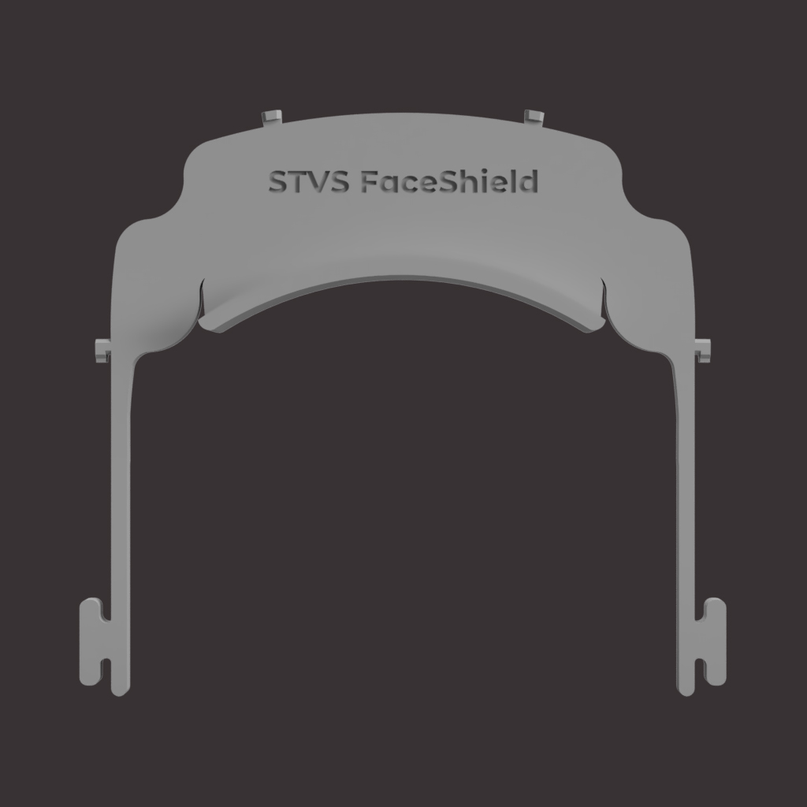
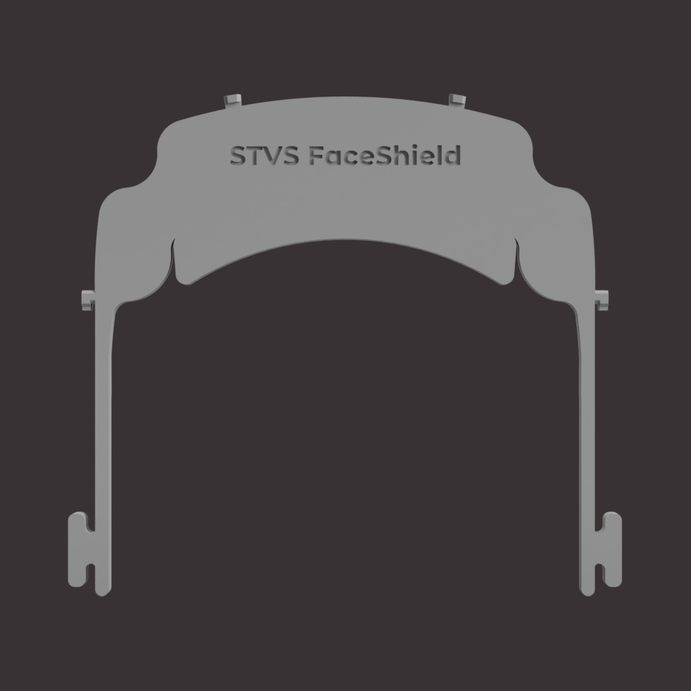

A 3D-printed face shield mixing the ideas from other shields. It was created due to the COVID-19 pandemic of 2020 (December 2019), but is able to be useful afterwards...

[Also available on NIH 3D Print Exchange](https://3dprint.nih.gov/discover/3dpx-013560)

## About STVS FaceShield
My take on a face-shield results in "STVS FaceShield". It's based on the model by 3DVERKSTAN (for EU hole punchers), where i extended the front, to get more breathing room between the face and the visor. I also replaced the bottom part with the PRUSA model, edited to have the same size. I've published two versions. One has the same height all the way, the other one contains a higher face-touching area, as high as PRUSA's model.

 V3 with the same height all over.

 V3 with an expanded face-touching area.

I designed it with my current experience in 3d-modeling, printing and manufacturing setup in mind. With my small printing bed, some edits were needed. Because of that, it needs an elastic band behind the shield. In return it can be cut to the desired length (at least 33cm), fitting on more heads in a personalized manner.
With the small version, similar printing speeds as for 3DVERKSTAN's model could be achieved (for some specific 3D printers of course), making it easier to produce in mass quantities.
If you want a face shield, that is not too big, less time-consuming to print per piece and as easy to assemble as possible, STVS FaceShield may be the shield for you.

# If you want to produce shields for others, PLEASE READ THIS CAREFULLY
## For legal reasons, no 3d-printed shield or other DIY solution can be called either a medical product or personal protective equipment, except they are certified!
But some are used in medical environments, some are even checked by professionals (for example by one ministry of health or other health organisation). Always consult the most recent information from both the model authors as well as your government. We want those products and everyone to be as safe as possible.

PRUSA and 3DVERKSTAN already have documents describing the safe way of manufacturing and handling them:

<ul>
                        <li><a href="https://manual.prusa3d.com/Guide/How+to+assemble+the+Prusa+Face+Shield+-+RC1-RC2-RC3/1527#_ga=2.144501437.928973681.1586040298-2037435839.1583232141">PRUSA's manufacturing guide</a></li>
                        <li><a href="https://3dverkstan.se/protective-visor/">3DVERKSTANS's project site. The handling guide is in swedish though. Others are also in english.</a></li>
                    </ul>
                    
But summarized, it would be the following:
* Wear a face mask and fresh gloves, for handling each batch of printed parts.
* Store each part seperately in a sealable bag.
* Always consult with the recipients. They might want some asjustments. ALSO tell them about your manufacturing environment (They might guide you to manufacturing them safely).
* Minimize the risk of cross contamination.
* Check each printed part, regarding it's quality.
* Follow the laws and other regulations for your country.

## Manufacturing STVS FaceShields
With all safety measures in place, you can follow these reccomendations:
* Print with PETG (if available for you), or similar material. They can withstand sanitizers a bit better.
* My commonly used layer height for them is 0.2mm. (I don't really trust bigger layer heights with my 3D-Printer yet.)
* I print them with at least three (3) perimeters.
* I set the infill to 30%.

For the visor (Based on 3DVERKSTAN's guide):
* I use transparent sheets for overhead-projectors. Laminating foil can be used as well (Both in DIN-A4)
* My EU sized hole puncher was set to A6. (You may need to punch holes on one of the two sides a bit smaller or larger than A6. You should test it with some regular A4 paper, just in case.)
* Make one punch on one side of the long side of your sheet.
* Flip the sheet around it's short axis and repeat punching on the opposite side.
* On said long side, there should be four (4 holes)
